# MES210TC Continuous and Discrete Time Signals and Systems Coursework

This repository contains MATLAB solutions for the MES210TC laboratory coursework. The coursework asks for MATLAB code, generated figures, and short observations for continuous-time signals, LTI systems, Fourier analysis, modulation, and pole-zero analysis.

## How to Run

Run all scripts and regenerate every required figure:

```matlab
run('run_all.m')
```

The batch runner disables the tremolo audio playback during automated verification and saves all outputs to `figures/` as both `.png` and `.fig` files. The verification log is saved as `figures/matlab_run_log.txt`.

The formal LaTeX coursework report is available as `MES210_report.tex`, with the compiled PDF at `MES210_report.pdf`.

Verified locally with MATLAB R2024a on 7 June 2026. The local MATLAB installation includes Signal Processing Toolbox but not Control System Toolbox, so scripts that are required by the manual to use `impulse`, `lsim`, or `pzmap` call those functions when available and otherwise use equivalent analytical or numerical fallback methods.

## File Structure

| File | Purpose |
| --- | --- |
| `Q1_1.m` | Basic continuous-time signals and tremolo waveform |
| `Q1_2.m` | Time shifting, scaling, reversal, and composite transformation |
| `Q1_3.m` | Continuous-time LTI impulse and zero-state response |
| `Q1_4.m` | Numerical convolution and sampling-interval error analysis |
| `Q2_1.m` | Fourier series spectra of periodic rectangular pulses |
| `Q2_2.m` | Frequency-domain LTI steady-state sinusoidal response |
| `Q3_1.m` | RLC low-pass filter frequency response and zero-state output |
| `Q3_2.m` | AM-DSB-SC modulation, coherent demodulation, and LPF recovery |
| `Q4_1.m` | Geometric frequency-response evaluation from poles and zeros |
| `Q4_2.m` | Pole-zero map and stability judgement |
| `run_all.m` | Runs and verifies all MATLAB scripts |
| `save_all_figures.m` | Saves all open MATLAB figures |

## Experiment Requirements and Solutions

### Experiment 1.1: Basic Continuous-Time Signals

Requirements:

- Generate and plot `x1(t)=3e^(-2t)u(t)`.
- Generate and plot `x2(t)=1.5sin(4*pi*t-pi/3)`.
- Generate and plot a rectangular pulse with amplitude 1.5 over `0 <= t <= 2`.
- Generate tremolo signal `x4(t)=sin(2*pi*880t)*(1+0.7sin(2*pi*5t))`, plot the first 0.5 s, and play the 3 s audio.

Solution:

- `Q1_1.m` creates each signal using MATLAB vector operations and logical masks.
- The rectangular pulse uses `double(t >= 0 & t <= 2)`.
- Tremolo is generated by multiplying a carrier and a low-frequency modulator.
- During batch verification, `MES210_SKIP_SOUND=1` disables `sound()` so the script runs unattended.

Generated figures:

- `figures/Q1_1_fig1.png`
- `figures/Q1_1_fig2.png`
- `figures/Q1_1_fig3.png`
- `figures/Q1_1_fig4.png`

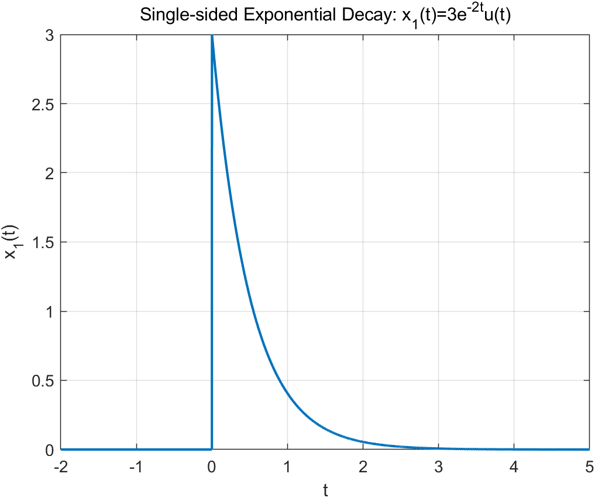
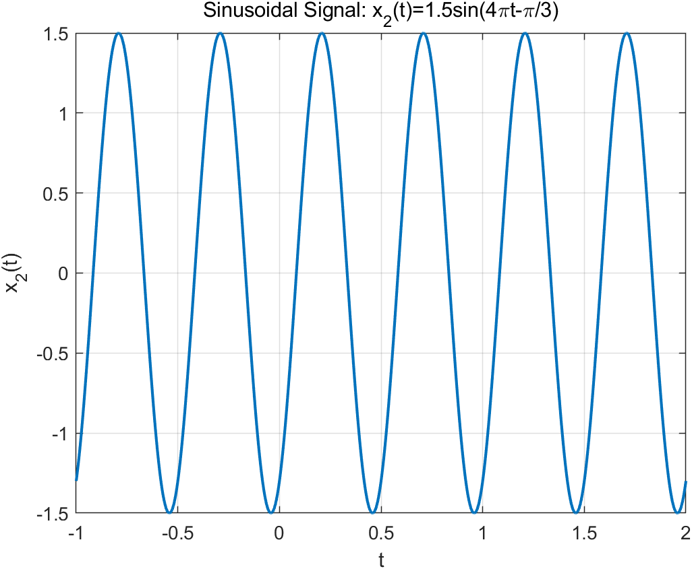
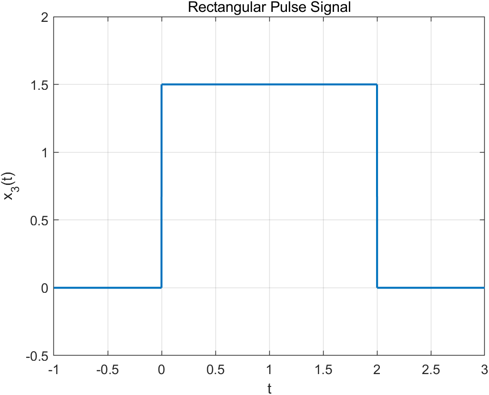
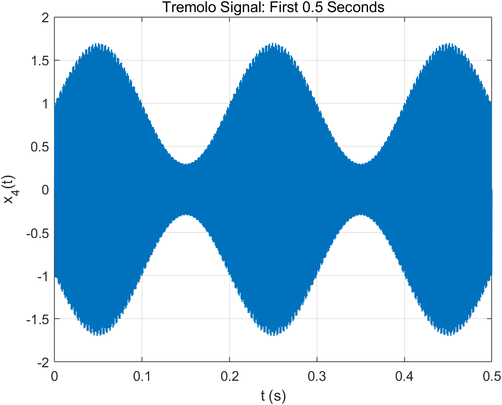

### Experiment 1.2: Basic Signal Operations

Requirements:

- Plot original piecewise signal `f(t)`.
- In the same figure, use subplots for `f(t-2)`, `f(3t)`, `f(-t)`, and `f(-3t-2)`.
- Answer transformation-order questions.

Solution:

- `Q1_2.m` implements the base signal as a piecewise logical expression.
- Each transformation is computed by replacing the argument of `f` with the transformed time variable.
- For `f(-3t-2)`, the inside argument is `-3(t+2/3)`, so it can be understood as a left shift by `2/3`, time reversal, and compression. In general, changing the order of shifting, scaling, and reversal changes the result unless the transformed argument remains algebraically identical.
- `f(3t)` is compressed by a factor of 3, while `f(t/3)` is expanded by a factor of 3.

Generated figure:

- `figures/Q1_2_fig1.png`

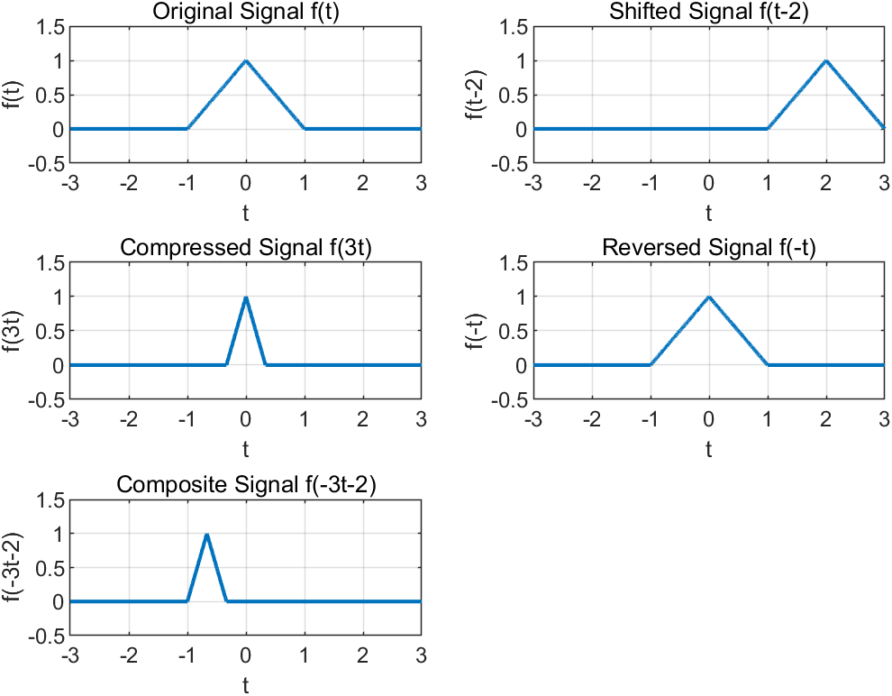

### Experiment 1.3: Continuous-Time LTI System

Requirements:

- Model `y''(t)+3y'(t)+2y(t)=x'(t)+2x(t)`.
- Determine transfer-function coefficient vectors.
- Plot impulse response with `impulse()`.
- Plot zero-state response to `x(t)=e^(-2t)u(t)` with `lsim()`.

Solution:

- The transfer function is:

```text
H(s) = (s+2)/(s^2+3s+2)
```

- The coefficient vectors are `num=[1 2]` and `den=[1 3 2]`.
- Since `s^2+3s+2=(s+1)(s+2)`, the system reduces to `H(s)=1/(s+1)` after cancellation.
- If Control System Toolbox is installed, `Q1_3.m` uses `tf`, `impulse`, and `lsim`.
- In the verified local environment, the fallback uses `h(t)=e^(-t)u(t)` and `y_zs(t)=e^(-t)-e^(-2t)`.

Generated figure:

- `figures/Q1_3_fig1.png`

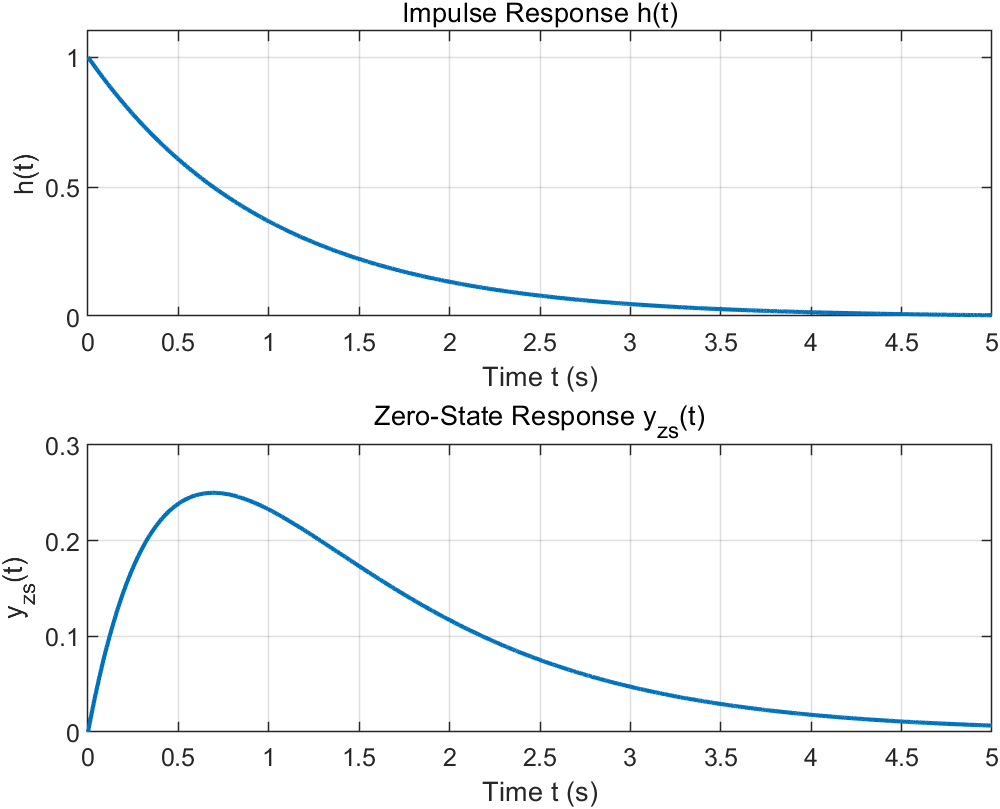

### Experiment 1.4: Numerical Convolution

Requirements:

- Compute `y(t)=f1(t)*f2(t)` using `conv`.
- Use sampling interval `p=0.05`.
- Compare `p=0.2, 0.1, 0.05, 0.02`.
- Use `p=0.001` as the reference and compute MSE and maximum error.

Solution:

- `Q1_4.m` discretizes both rectangular signals and computes `conv(f1,f2)*p`.
- The output time vector spans from `min(t1)+min(t2)` to `max(t1)+max(t2)`.
- The result approaches the analytical triangular convolution shape as `p` decreases.
- Error results from the verified run:

| p | MSE | Max Error |
| --- | ---: | ---: |
| 0.200 | 0.184181 | 0.597000 |
| 0.100 | 0.044849 | 0.297000 |
| 0.050 | 0.010897 | 0.147000 |
| 0.020 | 0.001630 | 0.057000 |

Generated figure:

- `figures/Q1_4_fig1.png`
- `figures/Q1_4_fig2.png` supplementary reference and error comparison

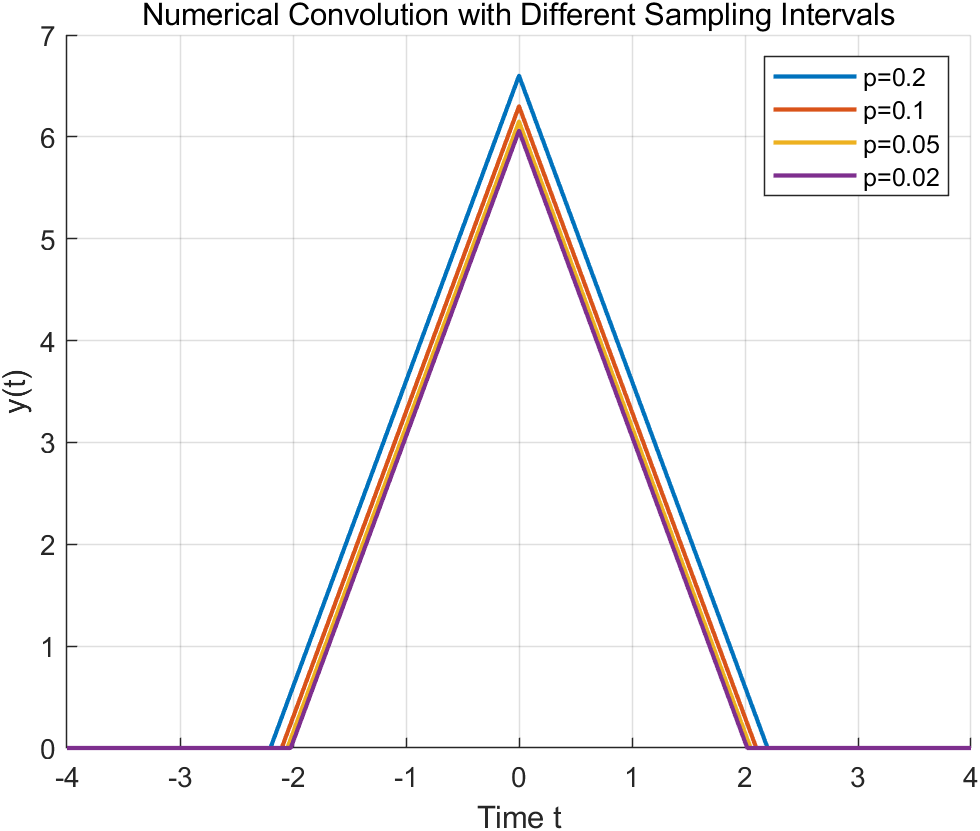
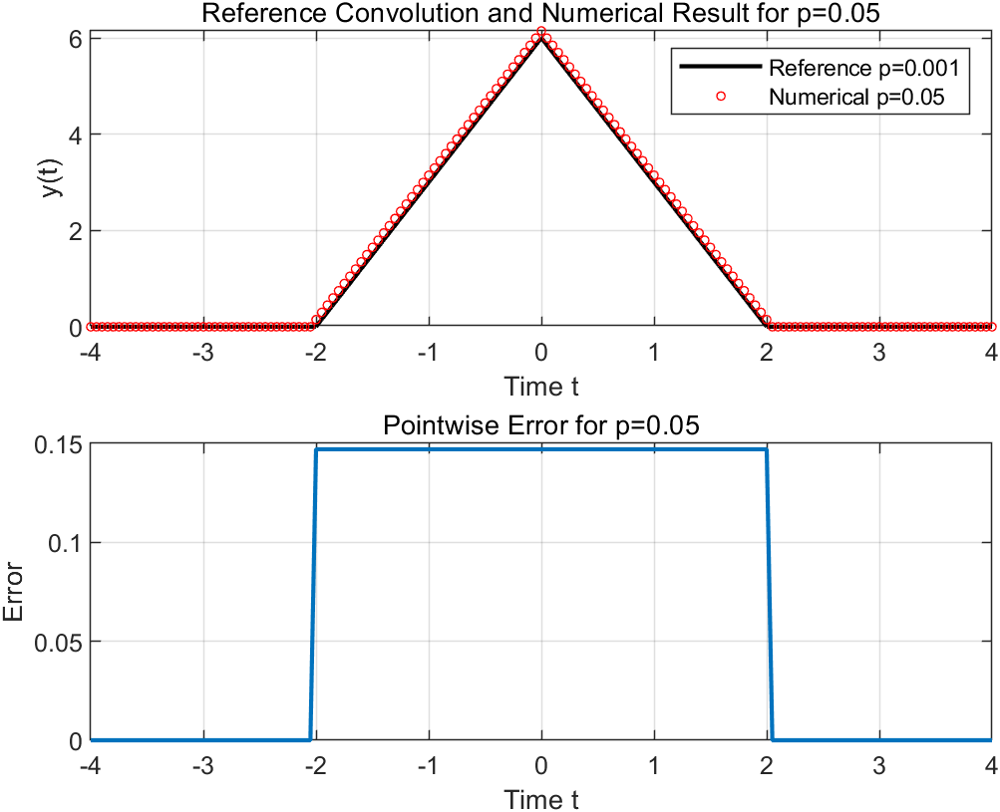

### Experiment 2.1: Fourier Series of Rectangular Pulses

Requirements:

- Compute exponential Fourier series coefficients for periodic rectangular pulses with `T=8` and `tau=4,2,1`.
- Use `k=-20:20`.
- Use a `2x2` subplot: time-domain pulses and three magnitude spectra.

Solution:

- `Q2_1.m` computes:

```text
c_k = (tau/T) * sinc(k*tau/T)
```

- Wider pulse width gives a larger DC coefficient and a narrower main lobe.
- Spectral-line spacing is determined by the period `T`, not `tau`, so it does not change across the three cases.
- Narrower time-domain pulses correspond to wider frequency-domain bandwidth.

Generated figure:

- `figures/Q2_1_fig1.png`

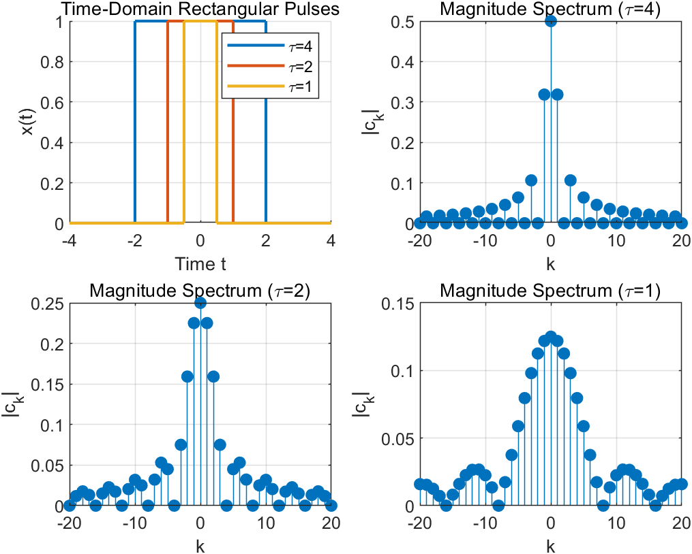

### Experiment 2.2: Frequency-Domain LTI System

Requirements:

- Analyze `H(jw)=1/((jw)^2+2jw+5)`.
- Evaluate magnitude and phase at `w=2` and `w=15`.
- Construct and plot output for `x(t)=3cos(2t)+2cos(15t)`.

Solution:

- `Q2_2.m` evaluates `H` at both frequencies and applies amplitude scaling and phase shifting.
- Verified values:

| Frequency | Magnitude | Phase |
| --- | ---: | ---: |
| `w=2` | 0.2425 | -1.3258 rad |
| `w=15` | 0.0045 | -3.0061 rad |

- The system behaves like a low-pass filter because the high-frequency component at `15 rad/s` is strongly attenuated.
- A supplementary magnitude-response figure marks `w=2` and `w=15`, making the attenuation difference visible.

Generated figure:

- `figures/Q2_2_fig1.png`
- `figures/Q2_2_fig2.png` supplementary frequency-response verification

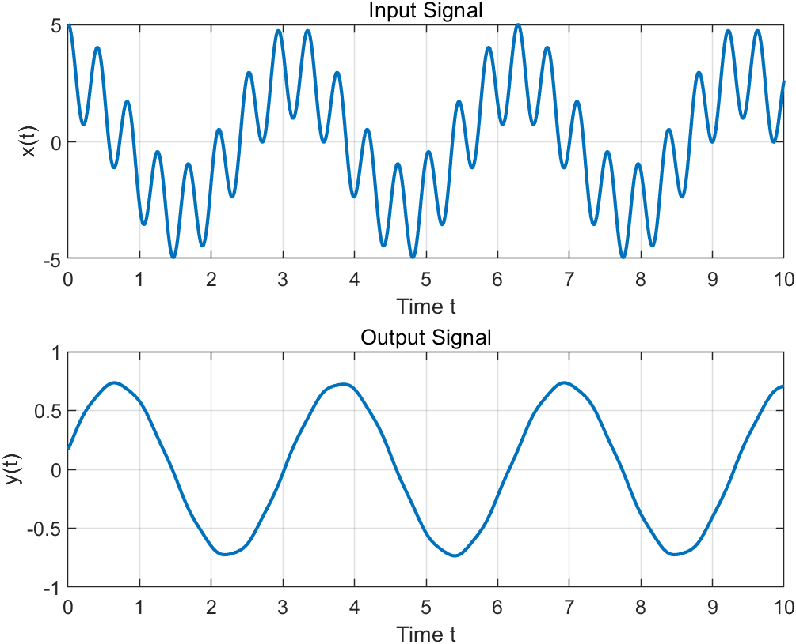
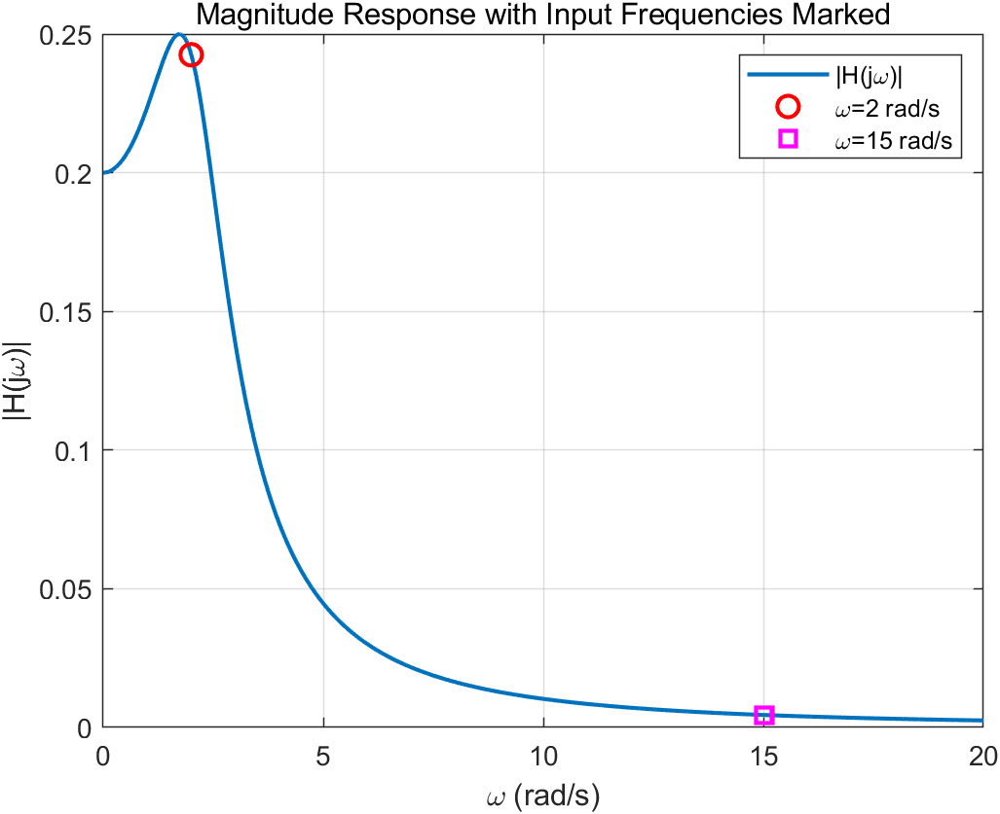

### Experiment 3.1: RLC Low-Pass Filter

Requirements:

- Model `H(s)=1/(LCs^2+RCs+1)` with `L=0.6 H`, `C=0.2 F`, `R=2 ohm`.
- Use `freqs()` for magnitude and phase response.
- Use `lsim()` to compute zero-state response for `x(t)=sin(t)+sin(20t)`.

Solution:

- `Q3_1.m` uses `freqs(num,den,w)` for the frequency response.
- If Control System Toolbox is available, it uses `lsim`; otherwise it solves the equivalent second-order ODE under zero initial conditions.
- The verified estimate for the `-3 dB` cutoff frequency is approximately `3.40 rad/s`.
- The `20 rad/s` component is attenuated much more than the `1 rad/s` component, confirming low-pass behavior.
- Increasing `R` increases damping, reduces resonance, and generally makes the transition smoother.

Generated figures:

- `figures/Q3_1_fig1.png`
- `figures/Q3_1_fig2.png`

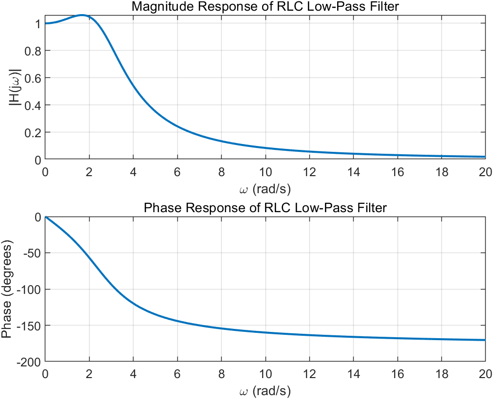
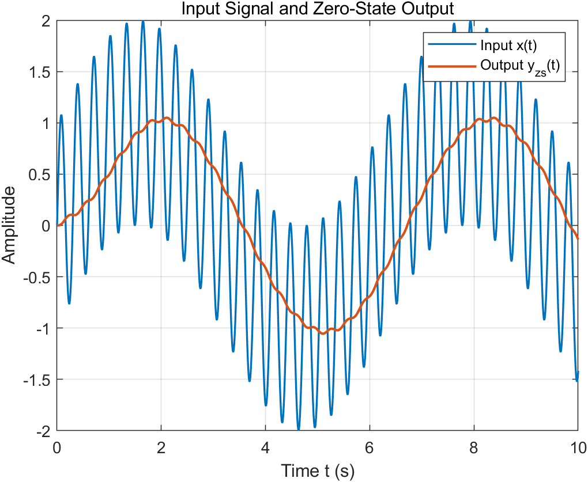

### Experiment 3.2: AM Modulation and Demodulation

Requirements:

- Generate baseband `g(t)=4cos(8t)+3cos(16t)`.
- Generate carrier `c(t)=cos(120t)`.
- Generate modulated signal `f(t)=g(t)c(t)`.
- Coherently demodulate with `g0(t)=f(t)c(t)`.
- Apply ideal low-pass filter with `|w|<25`.
- Plot all time-domain signals and spectra.

Solution:

- `Q3_2.m` uses FFT, `fftshift`, ideal frequency-domain masking, `ifftshift`, and `ifft`.
- Modulation shifts baseband components to `120 +/- 8` and `120 +/- 16 rad/s`.
- Multiplying by the carrier again creates baseband terms and high-frequency terms near `240 rad/s`.
- The low-pass filter keeps the baseband terms and removes the high-frequency terms.
- Because `cos^2(120t)=0.5+0.5cos(240t)`, the recovered signal is scaled unless a gain correction is added.
- A supplementary comparison plots `g(t)`, `g_1(t)`, and `2g_1(t)`. The verified MSE decreases from `3.124869` for `g_1(t)` to `0.000310` for `2g_1(t)`, confirming that the recovered waveform shape is correct and mainly needs amplitude restoration.

Generated figures:

- `figures/Q3_2_fig1.png`
- `figures/Q3_2_fig2.png`
- `figures/Q3_2_fig3.png` supplementary amplitude-restoration comparison

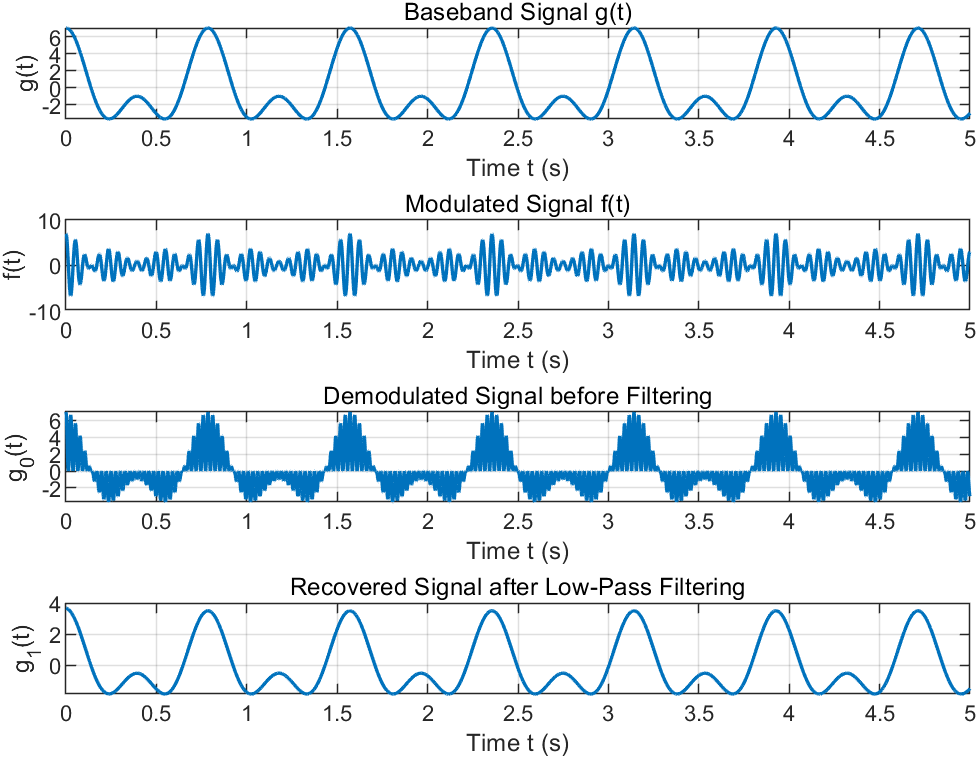
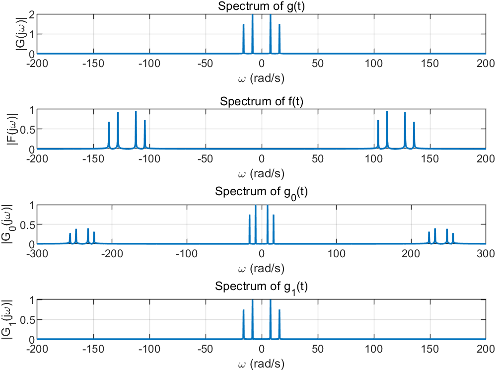
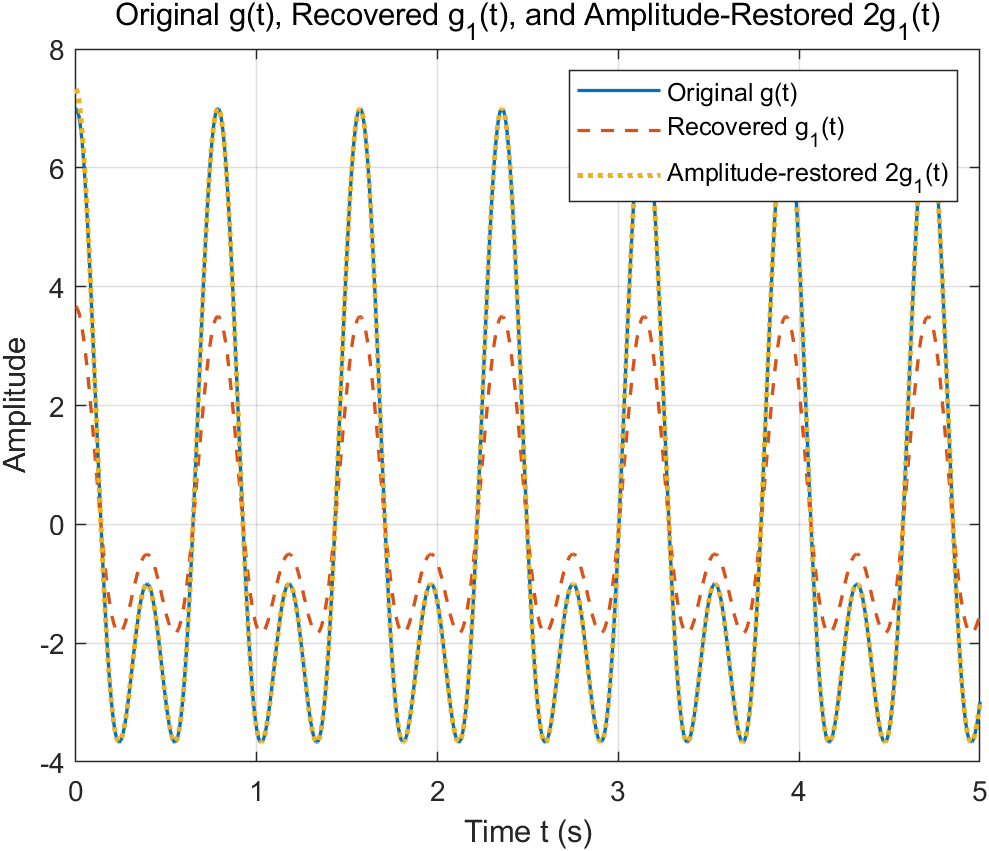

### Experiment 4.1: Geometric Frequency Response from Poles and Zeros

Requirements:

- Plot poles `-80`, `-120` and double zero at `0`.
- Compute `|H(jw)|` geometrically for `f=0:1:1000 Hz`.
- Verify with `freqs()`.

Solution:

- `Q4_1.m` computes:

```text
|H(jw)| = |jw-z1||jw-z2| / (|jw-p1||jw-p2|)
```

- The double zero at the origin forces low-frequency gain to start near zero.
- As frequency increases, the numerator grows faster at first, so the response rises and approaches high-pass behavior.
- The `freqs()` curve is overlaid with the geometric result for verification.
- A supplementary geometric-distance figure marks one point `jw0` and draws the distance vectors from that point to the double zero and both poles, directly illustrating the magnitude formula.

Generated figure:

- `figures/Q4_1_fig1.png`
- `figures/Q4_1_fig2.png` supplementary geometric distance illustration

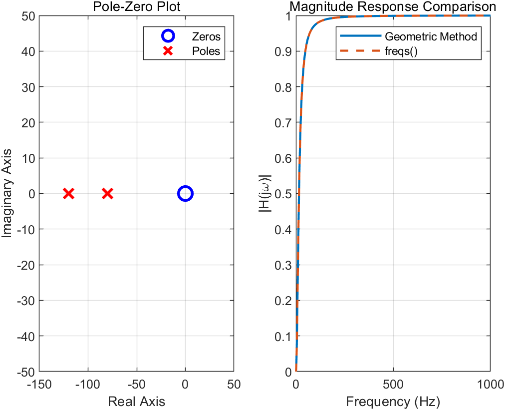
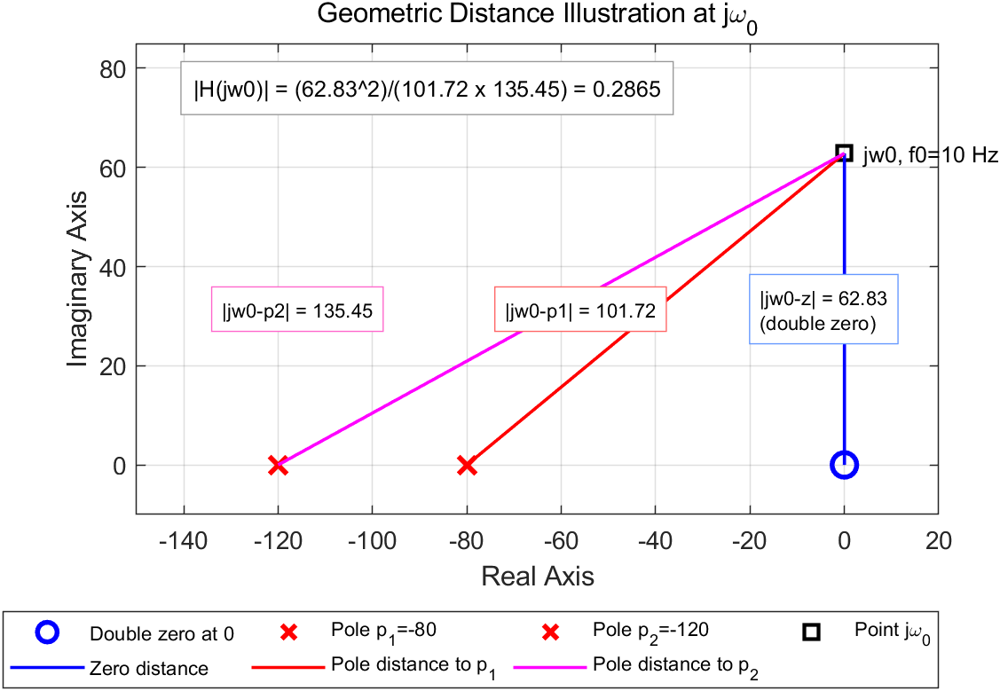

### Experiment 4.2: Pole-Zero Map and Stability

Requirements:

- For `H(s)=(s^2+4s+3)/(s^3+s^2+7s+2)`, plot pole-zero map with `pzmap`.
- Determine stability from pole locations.

Solution:

- `Q4_2.m` computes zeros and poles with `roots`.
- If Control System Toolbox is available, it uses `pzmap`; otherwise it plots the same pole-zero map manually.
- The plotted pole-zero map includes damping-ratio rays, natural-frequency arcs, and annotation boxes for damping ratio, overshoot, and natural frequency. This makes the stability judgement and pole dynamics easier to read directly from the figure.
- Verified poles:

```text
-0.3528 +/- 2.5822i
-0.2945
```

- All poles have negative real parts, so the system is stable.

Generated figure:

- `figures/Q4_2_fig1.png`

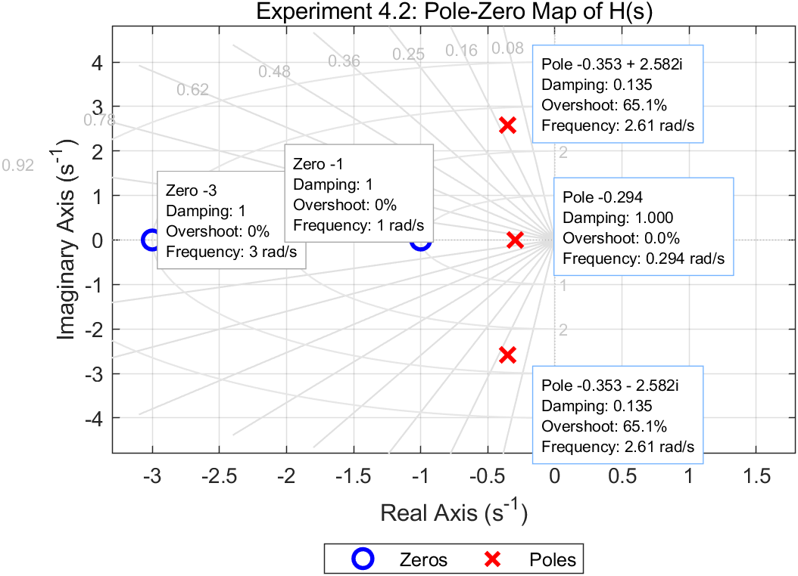

## Verification Summary

The command below was run successfully:

```powershell
matlab -batch "run('run_all.m')"
```

All ten coursework scripts completed successfully and all required figures were saved in `figures/`.
